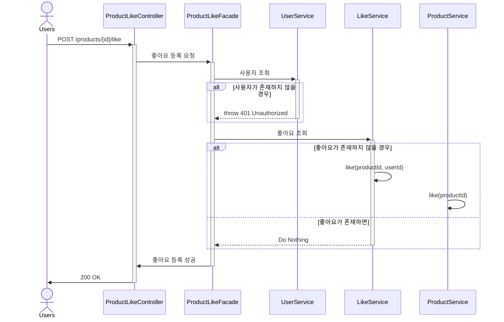
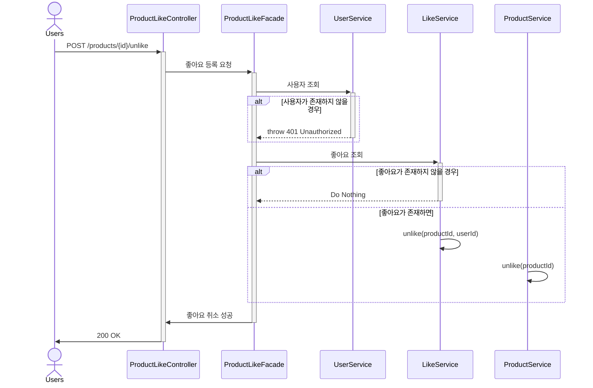
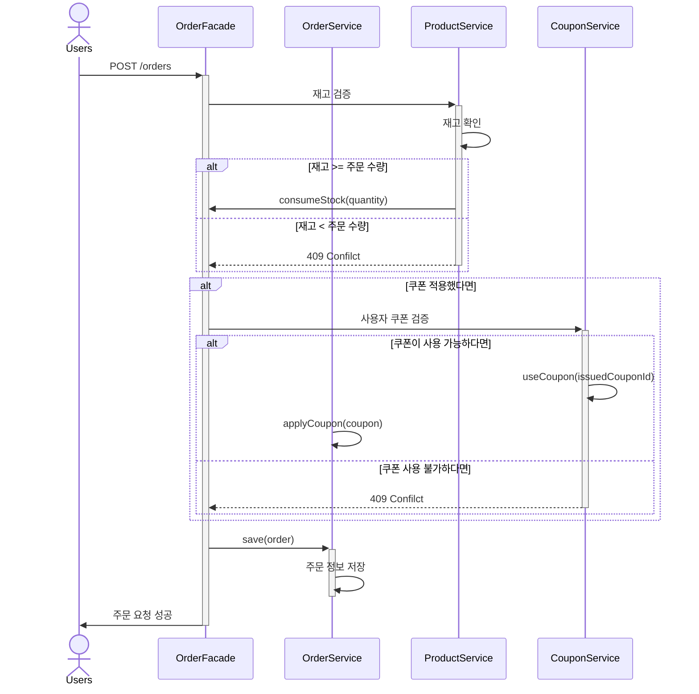
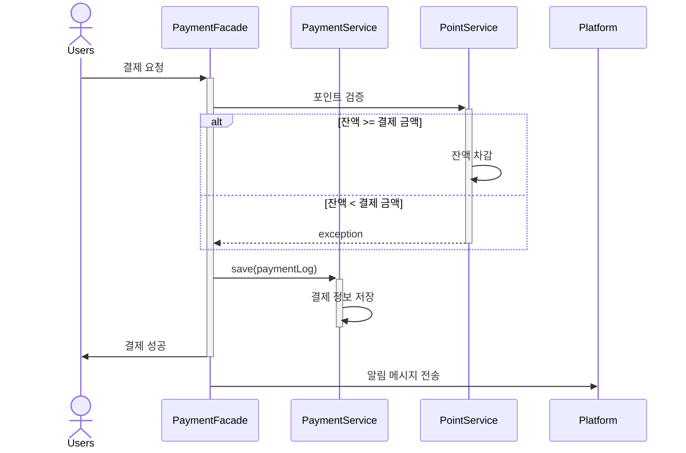

# 시퀀스 다이어그램
## 1. 좋아요 등록

```mermaid
sequenceDiagram
    actor Users
    participant PLC as ProductLikeController
    participant PLF as ProductLikeFacade
    participant US as UserService
    participant LS as LikeService
	participant PS as ProductService

    Users->>+PLC: POST /products/{id}/like
	PLC->>+PLF: 좋아요 등록 요청
	PLF->>+US: 사용자 조회
	alt 사용자가 존재하지 않을 경우
	US-->>-PLF: throw 401 Unauthorized
	end
	
	PLF->>+LS: 좋아요 조회  
	alt 좋아요가 존재하지 않을 경우
	LS->>LS: like(productId, userId)
	PS->>PS: like(productId)
	else 좋아요가 존재하면
	LS-->>-PLF: Do Nothing
	end
    PLF->>-PLC: 좋아요 등록 성공
    PLC->>-Users: 200 OK
```

## 2. 좋아요 취소

```mermaid
sequenceDiagram
    actor Users
    participant PLC as ProductLikeController
    participant PLF as ProductLikeFacade
    participant US as UserService
    participant LS as LikeService
    participant PS as ProductService

    Users->>+PLC: POST /products/{id}/unlike
    PLC->>+PLF: 좋아요 등록 요청
    PLF->>+US: 사용자 조회
    alt 사용자가 존재하지 않을 경우
        US-->>-PLF: throw 401 Unauthorized
    end

    PLF->>+LS: 좋아요 조회
    alt 좋아요가 존재하지 않을 경우
        LS-->>-PLF: Do Nothing
    else 좋아요가 존재하면
        LS->>LS: unlike(productId, userId)
        PS->>PS: unlike(productId)
    end
    PLF->>-PLC: 좋아요 취소 성공
    PLC->>-Users: 200 OK
```

## 3. 주문 요청

```mermaid
sequenceDiagram
	actor Users
	participant OF as OrderFacade
	participant OS as OrderService
	participant PS as ProductService
	participant CS as CouponService

    Users->>+OF: POST /orders
    OF->>+PS: 재고 검증
    PS->>PS: 재고 확인
	
	alt 재고 >= 주문 수량
	PS->>OF: consumeStock(quantity)
	else 재고 < 주문 수량
	PS-->>-OF: 409 Confilct
	end
	
	alt 쿠폰 적용했다면
	OF->>+CS: 사용자 쿠폰 검증
		alt 쿠폰이 사용 가능하다면
		CS->>CS: useCoupon(issuedCouponId)
		OS->>OS: applyCoupon(coupon)
		else 쿠폰 사용 불가하다면
		CS-->>-OF: 409 Confilct
		end
    end
    OF->>+OS: save(order)
    OS->>-OS: 주문 정보 저장
    OF->>-Users: 주문 요청 성공
	
```
## 4. 결제 요청

```mermaid
sequenceDiagram
    actor Users
    participant PF as PaymentFacade
    participant PMS as PaymentService
    participant PS as PointService
    participant Platform

    Users->>+PF: 결제 요청
    PF->>+PS: 포인트 검증
	alt 잔액 >= 결제 금액
        PS->>PS: 잔액 차감
	else 잔액 < 결제 금액
        PS-->>-PF: exception
	end
    PF->>+PMS: save(paymentLog)
    PMS->>-PMS: 결제 정보 저장
    PF->>-Users: 결제 성공
    PF->>Platform: 알림 메시지 전송
 
```