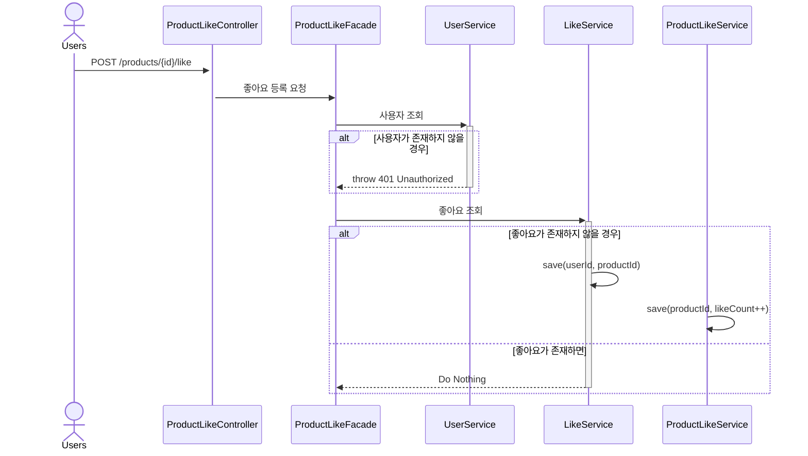
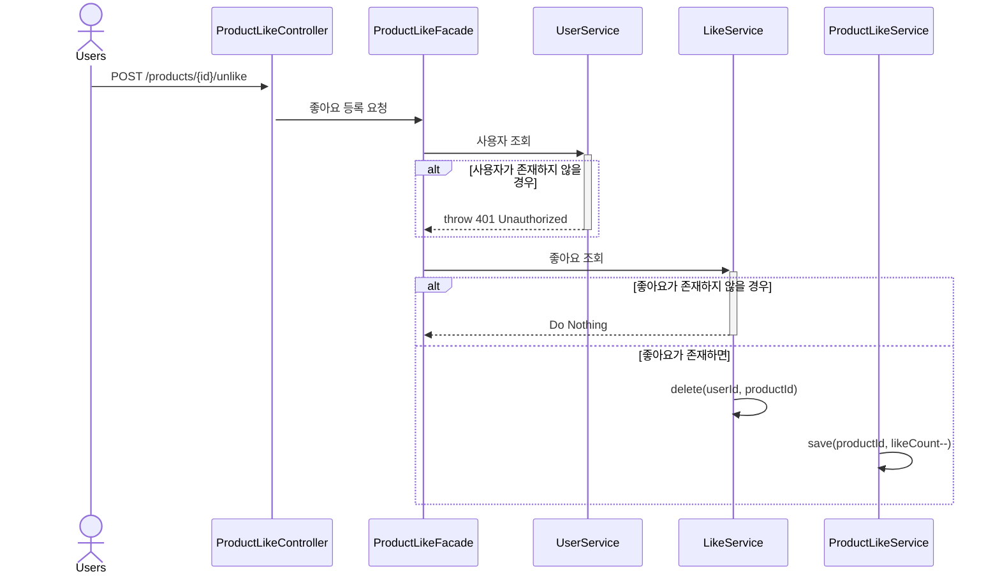
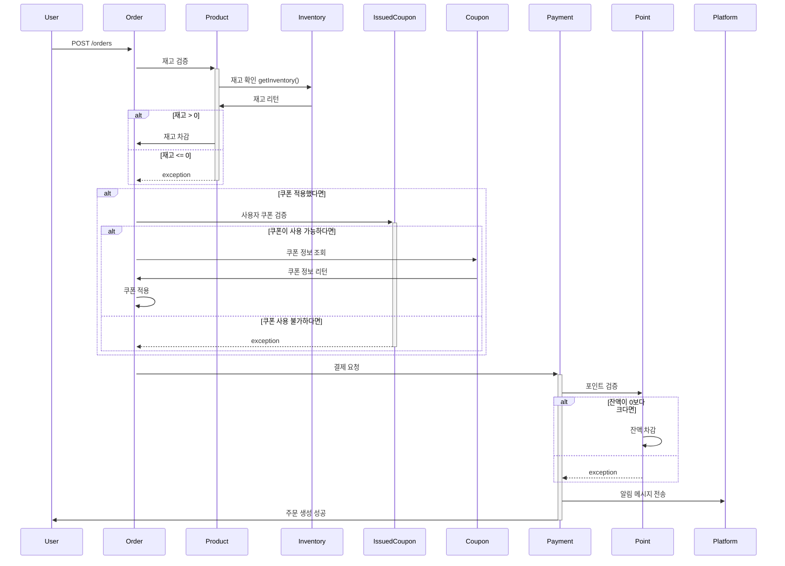

# 시퀀스 다이어그램
## 1. 좋아요 등록

```mermaid
sequenceDiagram
    actor Users
    participant PLC as ProductLikeController
    participant PLF as ProductLikeFacade
    participant US as UserService
    participant LS as LikeService
	participant PLS as ProductLikeService

    Users->>+PLC: POST /products/{id}/like
	PLC->>PLF: 좋아요 등록 요청
	PLF->>+US: 사용자 조회
	alt 사용자가 존재하지 않을 경우
	US-->>-PLF: throw 401 Unauthorized
	end
	
	PLF->>+LS: 좋아요 조회  
	alt 좋아요가 존재하지 않을 경우
	LS->>LS: save(userId, productId)
	PLS->>PLS: save(productId, likeCount++)
	else 좋아요가 존재하면
	LS-->>-PLF: Do Nothing
	end
```

## 2. 좋아요 취소

```mermaid
sequenceDiagram
    actor Users
    participant PLC as ProductLikeController
    participant PLF as ProductLikeFacade
    participant US as UserService
    participant LS as LikeService
    participant PLS as ProductLikeService

    Users->>+PLC: POST /products/{id}/unlike
    PLC->>PLF: 좋아요 등록 요청
    PLF->>+US: 사용자 조회
    alt 사용자가 존재하지 않을 경우
        US-->>-PLF: throw 401 Unauthorized
    end

    PLF->>+LS: 좋아요 조회
    alt 좋아요가 존재하지 않을 경우
        LS-->>-PLF: Do Nothing
    else 좋아요가 존재하면
        LS->>LS: delete(userId, productId)
        PLS->>PLS: save(productId, likeCount--)
    end
```

## 3. 주문 요청

```mermaid
sequenceDiagram
	participant User
	participant Order
	participant Product
	participant Inventory
	participant IssuedCoupon
	participant Coupon
	participant Payment
	participant Point
	participant Platform

	User->>+Order: POST /orders
	Order->>+Product: 재고 검증
	Product->>Inventory: 재고 확인 getInventory()
	Inventory->>Product: 재고 리턴
	
	alt 재고 > 0
	Product->>Order: 재고 차감
	else 재고 <= 0
	Product-->>-Order: exception
	end
	
	alt 쿠폰 적용했다면
	Order->>+IssuedCoupon: 사용자 쿠폰 검증
		alt 쿠폰이 사용 가능하다면
		Order->>Coupon: 쿠폰 정보 조회
		Coupon->>Order: 쿠폰 정보 리턴
		Order->>Order: 쿠폰 적용
		else 쿠폰 사용 불가하다면
		IssuedCoupon-->>-Order: exception
		end
	end
	Order->>+Payment: 결제 요청
	Payment->>Point: 포인트 검증
	alt 잔액이 0보다 크다면
		Point->>Point: 잔액 차감
	else 
		Point-->>Payment: exception
	end
	Payment->>Platform: 알림 메시지 전송
  Payment->>-User: 주문 생성 성공
```