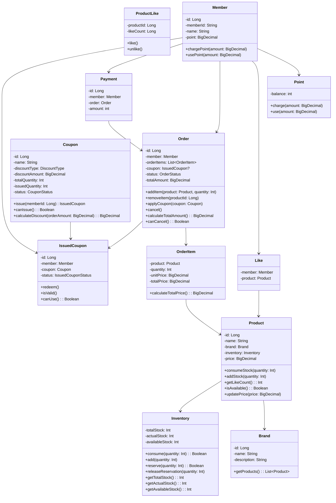

# 클래스 다이어그램

```mermaid
classDiagram
  class Product {
    -id: Long
    -name: String
    -brand: Brand
    -inventory: Inventory 
    -price: BigDecimal
    +consumeStock(quantity: Int)
    +addStock(quantity: Int)
    +getLikeCount(): Int
    +isAvailable(): Boolean
    +updatePrice(price: BigDecimal)
  }
  class ProductLike { 
      -productId: Long
      -likeCount: Long
      +like()
      +unlike()
  }
  class Inventory {
	  -totalStock: Int 
	  -actualStock: Int
	  -availableStock: Int
	  +consume(quantity: Int): Boolean
	  +add(quantity: Int)
	  +reserve(quantity: Int): Boolean
	  +releaseReservation(quantity: Int)
		+getTotalStock(): Int
		+getActualStock(): Int
	  +getAvailableStock(): Int
  }
  class Brand {
    -id: Long 
    -name: String
    -description: String
    +getProducts(): List~Product~
  }
  class Like {
    -member: Member 
    -product: Product
  }
  class Member {
    -id: Long 
    -memberId: String 
    -name: String
    -point: BigDecimal 
    +chargePoint(amount: BigDecimal)
    +usePoint(amount: BigDecimal)
  }
  class Point {
    -balance: int
    +charge(amount: BigDecimal)
    +use(amount: BigDecimal)
  }
  
  class Order {
    -id: Long
    -member: Member 
    -orderItems: List~OrderItem~
    -coupon: IssuedCoupon?
    -status: OrderStatus
    -totalAmount: BigDecimal
    +addItem(product: Product, quantity: Int)
    +removeItem(productId: Long)
    +applyCoupon(coupon: Coupon)
    +cancel()
    +calculateTotalAmount(): BigDecimal
    +canCancel(): Boolean
  }
  
  class OrderItem {
    -product: Product
    -quantity: Int
    -unitPrice: BigDecimal
    -totalPrice: BigDecimal
    +calculateTotalPrice(): BigDecimal
  }
  
  class Payment {
	  -id: Long 
	  -member: Member 
	  -order: Order 
	  -amount: int 
  }
  
  class Coupon {
    -id: Long
    -name: String 
    -discountType: DiscountType 
    -discountAmount: BigDecimal
    -totalQuantity: Int
    -issuedQuantity: Int
    -status: CouponStatus
    +issue(memberId: Long) IssuedCoupon
    +canIssue(): Boolean
    +calculateDiscount(orderAmount: BigDecimal): BigDecimal
  }
  
  class IssuedCoupon {
    -id: Long 
    -member: Member 
    -coupon: Coupon 
    -status: IssuedCouponStatus
    +redeem()
    +isValid()
    +canUse(): Boolean
  }
  
  Product --> Brand
  Product --> Inventory
  
  Member --> Point
  Member --> Like
  Member --> Order
  Member --> Payment
  Member --> IssuedCoupon
  
  Like --> Product
  
  Order --> OrderItem
  Order --> IssuedCoupon
  
  OrderItem --> Product
  
  Payment --> Order
  
  Coupon --> IssuedCoupon
```