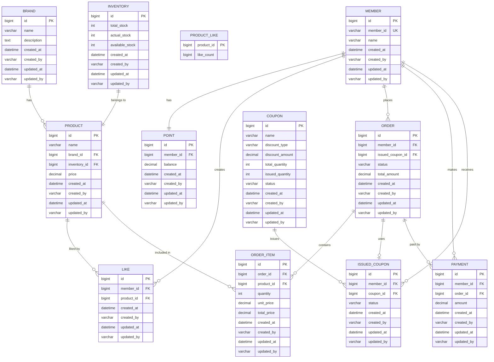

# ERD

```mermaid
erDiagram
    MEMBER {
        bigint id PK
        varchar member_id UK
        varchar name
        datetime created_at
        varchar created_by
        datetime updated_at
        varchar updated_by
    }

    POINT {
        bigint id PK
        bigint member_id FK
        decimal balance
        datetime created_at
        varchar created_by
        datetime updated_at
        varchar updated_by
    }
    
    BRAND {
        bigint id PK
        varchar name
        text description
        datetime created_at
        varchar created_by
        datetime updated_at
        varchar updated_by
    }

    PRODUCT {
        bigint id PK
        varchar name
        bigint brand_id FK
        bigint inventory_id FK
        decimal price
        datetime created_at
        varchar created_by
        datetime updated_at
        varchar updated_by
    }
    
    PRODUCT_LIKE {
        bigint product_id PK
        bigint like_count
    }
    
    INVENTORY {
        bigint id PK
        int total_stock
        int actual_stock
        int available_stock
        datetime created_at
        varchar created_by
        datetime updated_at
        varchar updated_by
    }
    
    LIKE {
        bigint id PK
        bigint member_id FK
        bigint product_id FK
        datetime created_at
        varchar created_by
        datetime updated_at
        varchar updated_by
    }
    
    ORDER {
        bigint id PK
        bigint member_id FK
        bigint issued_coupon_id FK
        varchar status
        decimal total_amount
        datetime created_at
        varchar created_by
        datetime updated_at
        varchar updated_by
    }
    
    ORDER_ITEM {
        bigint id PK
        bigint order_id FK
        bigint product_id FK
        int quantity
        decimal unit_price
        decimal total_price
        datetime created_at
        varchar created_by
        datetime updated_at
        varchar updated_by
    }
    
    PAYMENT {
        bigint id PK
        bigint member_id FK
        bigint order_id FK
        decimal amount
        datetime created_at
        varchar created_by
        datetime updated_at
        varchar updated_by
    }
    
    COUPON {
        bigint id PK
        varchar name
        varchar discount_type
        decimal discount_amount
        int total_quantity
        int issued_quantity
        varchar status
        datetime created_at
        varchar created_by
        datetime updated_at
        varchar updated_by
    }
    
    ISSUED_COUPON {
        bigint id PK
        bigint member_id FK
        bigint coupon_id FK
        varchar status
        datetime created_at
        varchar created_by
        datetime updated_at
        varchar updated_by
    }
    
    %% Relationships
    BRAND ||--o{ PRODUCT : "has"
    INVENTORY ||--|| PRODUCT : "belongs to"
    MEMBER ||--|| POINT : "has"
    MEMBER ||--o{ LIKE : "creates"
    MEMBER ||--o{ ORDER : "places"
    MEMBER ||--o{ PAYMENT : "makes"
    MEMBER ||--o{ ISSUED_COUPON : "receives"
    
    PRODUCT ||--o{ LIKE : "liked by"
    PRODUCT ||--o{ ORDER_ITEM : "included in"
    
    ORDER ||--o{ ORDER_ITEM : "contains"
    ORDER ||--o| ISSUED_COUPON : "uses"
    ORDER ||--o{ PAYMENT : "paid by"
    
    COUPON ||--o{ ISSUED_COUPON : "issues"
```