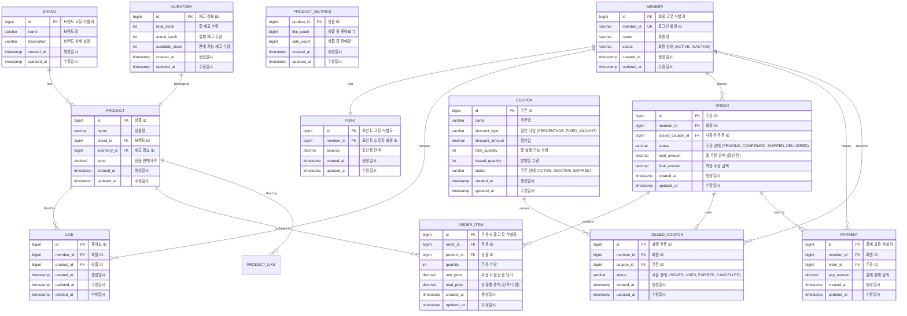

# ERD

```mermaid
erDiagram
    MEMBER {
        bigint id PK "회원 고유 식별자"
        varchar member_id UK "로그인 회원 ID"
        varchar name "회원명"
        varchar status "회원 상태 (ACTIVE, INACTIVE)"
        timestamp created_at "생성일시"
        timestamp updated_at "수정일시"
    }

    POINT {
        bigint id PK "포인트 고유 식별자"
        bigint member_id FK "포인트 소유자 회원 ID"
        decimal balance "포인트 잔액"
        timestamp created_at "생성일시"
        timestamp updated_at "수정일시"
    }
    
    BRAND {
        bigint id PK "브랜드 고유 식별자"
        varchar name "브랜드명"
        varchar description "브랜드 상세 설명"
        timestamp created_at "생성일시"
        timestamp updated_at "수정일시"
    }

    PRODUCT {
        bigint id PK "상품 ID"
        varchar name "상품명"
        bigint brand_id FK "브랜드 ID"
        bigint inventory_id FK "재고 정보 ID"
        decimal price "상품 판매가격"
        timestamp created_at "생성일시"
        timestamp updated_at "수정일시"
    }
    
    %% 상품별 지표 집계 테이블
    PRODUCT_METRICS {
        bigint product_id PK "상품 ID"
        bigint like_count "상품 총 좋아요 수"
        bigint sale_count "상품 총 판매량"
        timestamp created_at "생성일시"
        timestamp updated_at "수정일시"
    }
    
    INVENTORY {
        bigint id PK "재고 정보 ID"
        int total_stock "총 재고 수량"
        int actual_stock "실제 재고 수량"
        int available_stock "판매 가능 재고 수량"
        timestamp created_at "생성일시"
        timestamp updated_at "수정일시"
    }
    
    LIKE {
        bigint id PK "좋아요 ID"
        bigint member_id FK "회원 ID"
        bigint product_id FK "상품 ID"
        timestamp created_at "생성일시"
        timestamp updated_at "수정일시"
        timestamp deleted_at "삭제일시"
    }
    
    ORDER {
        bigint id PK "주문 ID"
        bigint member_id FK "회원 ID"
        bigint issued_coupon_id FK "사용된 쿠폰 ID"
        varchar status "주문 상태 (PENDING, CONFIRMED, SHIPPED, DELIVERED)"
        decimal total_amount "총 주문 금액 (할인 전)"
        decimal final_amount "최종 주문 금액"
        timestamp created_at "생성일시"
        timestamp updated_at "수정일시"
    }
    
    ORDER_ITEM {
        bigint id PK "주문 상품 고유 식별자"
        bigint order_id FK "주문 ID"
        bigint product_id FK "상품 ID"
        int quantity "주문 수량"
        decimal unit_price "주문 시점 상품 단가"
        decimal total_price "상품별 총액 (단가*수량)"
        timestamp created_at "생성일시"
        timestamp updated_at "수정일시"
    }
    
    PAYMENT {
        bigint id PK "결제 고유 식별자"
        bigint member_id FK "회원 ID"
        bigint order_id FK "주문 ID"
        decimal pay_amount "실제 결제 금액"
        timestamp created_at "생성일시"
        timestamp updated_at "수정일시"
    }
    
    COUPON {
        bigint id PK "쿠폰 ID"
        varchar name "쿠폰명"
        varchar discount_type "할인 타입 (PERCENTAGE, FIXED_AMOUNT)"
        decimal discount_amount "할인값"
        int total_quantity "총 발행 가능 수량"
        int issued_quantity "발행된 수량"
        varchar status "쿠폰 상태 (ACTIVE, INACTIVE, EXPIRED)"
        timestamp created_at "생성일시"
        timestamp updated_at "수정일시"
    }
    
    ISSUED_COUPON {
        bigint id PK "발행 쿠폰 ID"
        bigint member_id FK "회원 ID"
        bigint coupon_id FK "쿠폰 ID"
        varchar status "쿠폰 상태 (ISSUED, USED, EXPIRED, CANCELLED)"
        timestamp created_at "생성일시"
        timestamp updated_at "수정일시"
    }
    
    %% Relationships
    BRAND ||--o{ PRODUCT : "has"
    INVENTORY ||--|| PRODUCT : "belongs to"
    MEMBER ||--|| POINT : "has"
    MEMBER ||--o{ LIKE : "creates"
    MEMBER ||--o{ ORDER : "places"
    MEMBER ||--o{ PAYMENT : "makes"
    MEMBER ||--o{ ISSUED_COUPON : "receives"
    
    PRODUCT ||--o{ LIKE : "liked by"
    PRODUCT ||--o{ ORDER_ITEM : "included in"
    PRODUCT ||--o{ PRODUCT_LIKE : "liked by"
    
    ORDER ||--o{ ORDER_ITEM : "contains"
    ORDER ||--o| ISSUED_COUPON : "uses"
    ORDER ||--o{ PAYMENT : "paid by"
    
    COUPON ||--o{ ISSUED_COUPON : "issues"
```